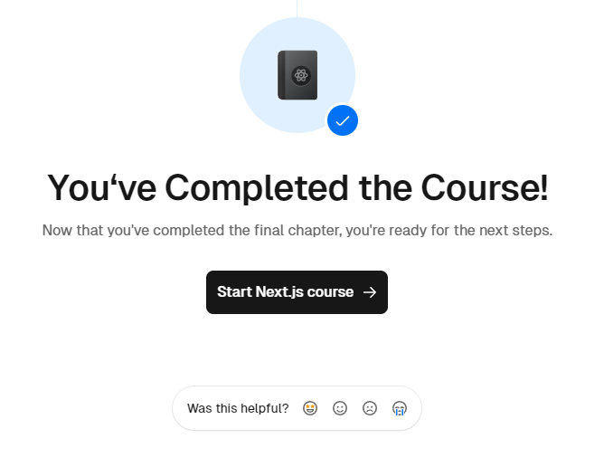

# NextJS tutorial - React foundations

The tutorial can be found at: [https://nextjs.org/learn/react-foundations](https://nextjs.org/learn/react-foundations)

## Credits

NextJS.org - tutorial
[https://nextjs.org/learn/react-foundations](https://nextjs.org/learn/react-foundations)

This README has been optimized for accessibility based on GitHub's blogpost "[Tips for Making your GitHub Profile Page Accessible](https://github.blog/2023-10-26-5-tips-for-making-your-github-profile-page-accessible)"

## License

[MIT](https://github.com/nervaccio/nextjs-react-foundations/blob/main/LICENSE)
